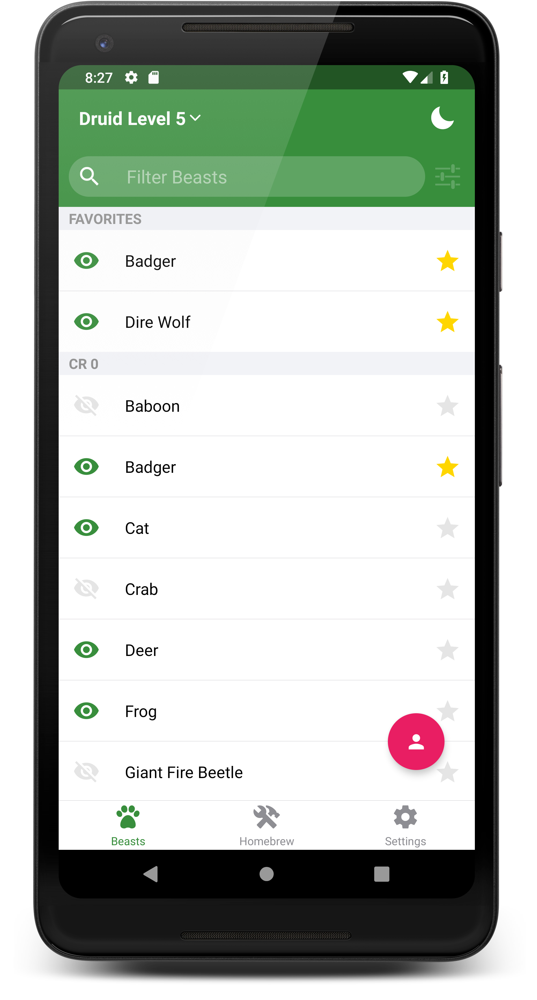

# Druidshape 5e

With this app you can enter your Druid level and see all the beasts you can shape into, as well as all their stats and abilities.

Features:

-   A quick reference to all the beasts in the basic rules for 5th edition
-   Auto filter beasts based on Druid level and Circle
-   Track which beasts your character has seen
-   Favorite beasts for quick access
-   Homebrew beast creator
-   Track multiple characters
-   Filter beast list based on if you've seen them, their movement types, or their environment

## Links

-   [Android](https://play.google.com/store/apps/details?id=com.adpyke.druidshape)
-   [iOS](https://itunes.apple.com/us/app/druidshape-5e/id1453786938)

## Screenshots

	
	
	

